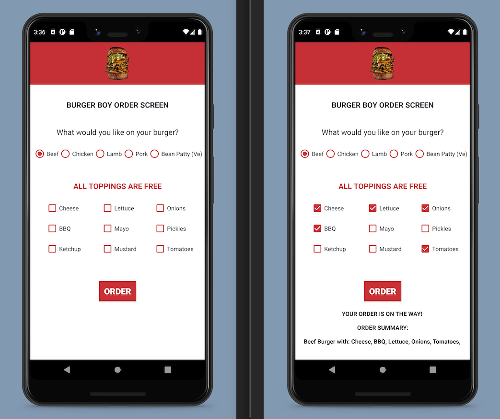

# Burger Boy

## About The Project

This Java Android project focussed around using Radio Buttons within a Radio Button Group, and Checkboxes to obtain user input from the layout.

## App Screenshots

## Built With

* [Java: 16.0.1](https://www.oracle.com/java/technologies/javase-jdk16-downloads.html)
* [Android Studio: 4.2](https://developer.android.com/studio)
* [Android Lollipop: (5.0)](https://www.android.com/intl/en_uk/versions/lollipop-5-0/)
* [Android 5.0: (API level 21)](https://developer.android.com/about/versions/lollipop)

## Prerequisites

* [Java: 16.0.1](https://www.oracle.com/java/technologies/javase-jdk16-downloads.html)
* [Android Studio: 4.2](https://developer.android.com/studio)
* [Android Lollipop: (5.0)](https://www.android.com/intl/en_uk/versions/lollipop-5-0/)
* [Android 5.0: (API level 21)](https://developer.android.com/about/versions/lollipop)

## License

Distributed under the MIT License. See `LICENSE` for more information.

## Contact

- [Email](mailto:aymerjames@gmail.com)
- [Linkedin](https://uk.linkedin.com/in/jamesaymer)
- [Github](https://github.com/JaymoAymer)
